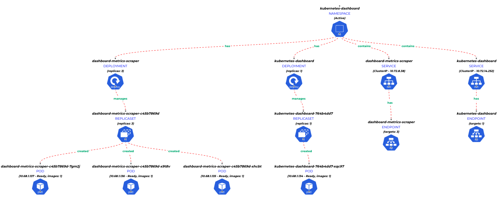

# KATEYES™ (beta) - Visual Kubernetes Explorer

## Introduction

Kateyes™ is a client server application that provides an eye into your kubernetes cluster. To visualize the cluster, kateyes - beta needs to be deployed into the cluster. 

## Motivation
Kubernetes is hard. But it solves lots of key problems that we have been experincing in the good old days. When an application gets deployed into the cluster, there are a set of kubernetes objects that get created with certain relationships between them. As the cluster grows and you deploy more and more applications, it gets seriously complex.

There is a standard tool 'kubectl' that most of us would use to explore the cluster but then you need to understand how to use it to get the best results in a short time. More over you would need to fire atleast a couple of kubectl commands with different options to find out related information from within your cluster. 

And just imagine you are handed over a cluster that has grown in the past years from a previous owner!

## Feautures
In its first Beta release, Kateyes provides a deep insights of your applications deployed in the cluster and most importantly the relationships between few of its important kubernetes objects in a explorable tree format. The relationship is limited to a specific namespace for now. The following objects are supported. 
- [namespace](https://kubernetes.io/docs/concepts/overview/working-with-objects/namespaces/)
- [pods](https://kubernetes.io/docs/concepts/workloads/pods/)
- [deployment](https://kubernetes.io/docs/concepts/workloads/controllers/deployment/)
- [replicaset](https://kubernetes.io/docs/concepts/workloads/controllers/replicaset/)
- [service](https://kubernetes.io/docs/concepts/services-networking/service/)
- [ingress](https://kubernetes.io/docs/concepts/services-networking/ingress/)
- [service endpoints](https://kubernetes.io/docs/concepts/services-networking/service/)

## Installation Requirements

You may incur cost to deploy the application into the cluster depending on your cloud subscriptions

## Compatibility

This application has been tested on Google Kubernetes Engine (GKE)

```bash
$ kubectl version
Client Version: version.Info{Major:"1", Minor:"23", GitVersion:"v1.23.6", GitCommit:"ad3338546da947756e8a88aa6822e9c11e7eac22", GitTreeState:"clean", BuildDate:"2022-04-14T08:49:13Z", GoVersion:"go1.17.9", Compiler:"gc", Platform:"linux/amd64"}
Server Version: version.Info{Major:"1", Minor:"21", GitVersion:"v1.21.10-gke.2000", GitCommit:"0823380786b063c3f71d5e7c76826a972e30550d", GitTreeState:"clean", BuildDate:"2022-03-17T09:22:22Z", GoVersion:"go1.16.14b7", Compiler:"gc", Platform:"linux/amd64"}

$ kubectl version --short
Client Version: v1.23.6
Server Version: v1.21.10-gke.2000
```

## How to Deploy

The client server app is easy to deploy. This repository consists of a several yaml manifests in "install" folder that needs to be applied with a simple command as below

```bash
kubectl apply -f install/.
```
This will install the client and server into a dedicated namespace 'kateyes'. It also deploys an nginx ingress controller configured with class name as 'kateyes-nginx'. After successfull deployment, you should get an external loadbalancer ip for the controller which can be used to access the application.

**NOTE:**
While deploying you may get an error message 'no endpoints available for service "ingress-nginx-controller-admission'. To resolve, wait for a short time for the endpoints to get registered and re-run the command aganin.

## Custom Ingress
If you do not want to deploy a new ingress controller and would like to connect to your existing controller
1. Do not apply the file '01-kateyes-nginx-ingress-ctrl.yaml'
2. Update the annotations kubernetes. io/ingress. class with appropriate ingress class 
   - 05-kateyes-client-ingress.yaml
   - 05-kateyes-server-ingress.yaml
3. Apply the changed configurations.


## TestData

If you want to use a new empty cluster to check the application, a TestData folder has been included containing a set of manifests that can be installed into the cluster. Once deployed it can be explored using Kateyes™

Use the command below to install the TestData

```bash
kubectl apply -f TestData/.
```

The TestData folder includes a folder 'load' which has manifests to deploy a large number of pods(40).

## Examples
'kube-system' namespace


'kubernates-dashboard' namespace



Sample TestData 'prod-env' namespace


